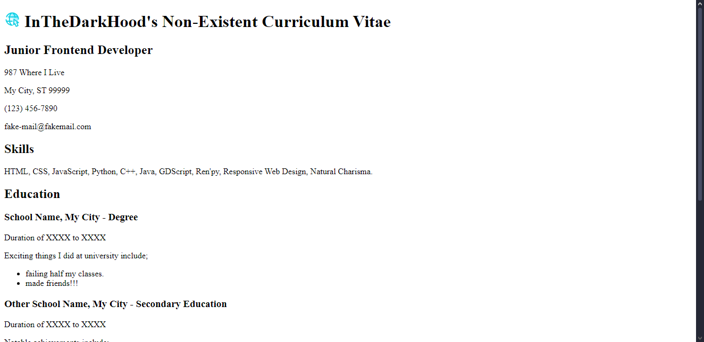

# Roadmap.sh - Frontend Solutions

All of my attempted solutions to the [Roadmap.sh](https://roadmap.sh) Frontend Projects.

1. [Single-Page CV](https://roadmap.sh/projects/single-page-cv)

## Completed Projects

  

## How to use

Simply download the folder and open the respective index.html file in your browser of choice.