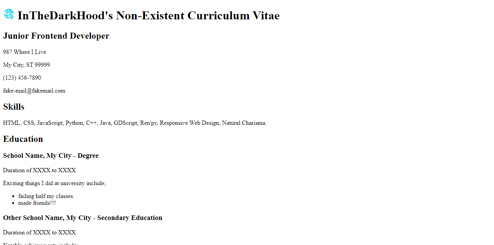

# Roadmap.sh - Frontend Solutions

All of my attempted solutions to the [Roadmap.sh](https://roadmap.sh) Frotend Projects.

1. [Single-Page CV]()

## Completed Projects

  <a href="./single-page-cv/index.html">
     Single-Page CV
  </a>

## How to use

Simply download the folder and open the respective index.html file in your browser of choice.