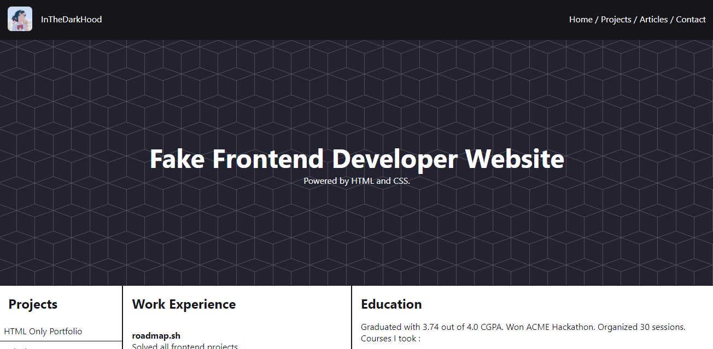

# Roadmap.sh - Frontend Solutions

All of my attempted solutions to the [Roadmap.sh](https://roadmap.sh) Frontend Projects.

1. [Single-Page CV](https://roadmap.sh/projects/single-page-cv)
2. [Basic HTML Website](https://roadmap.sh/projects/basic-html-website)
2. [Personal Portfolio](https://roadmap.sh/projects/portfolio-website)

## Completed Projects

  
  

  

## How to use

In order to view the project, download the respective folder of the project and open the index.html file in the browser of your choice. All filed related to the respective project will be in it's repsective folder unless specified otherwise.